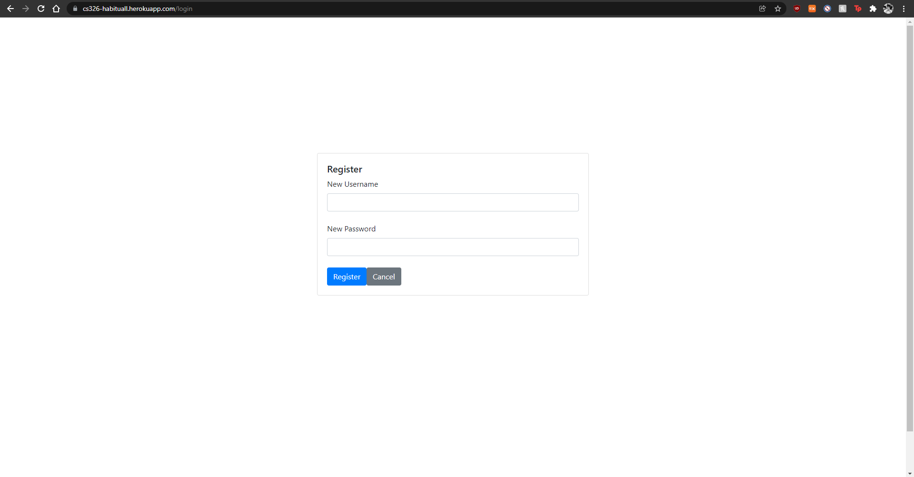
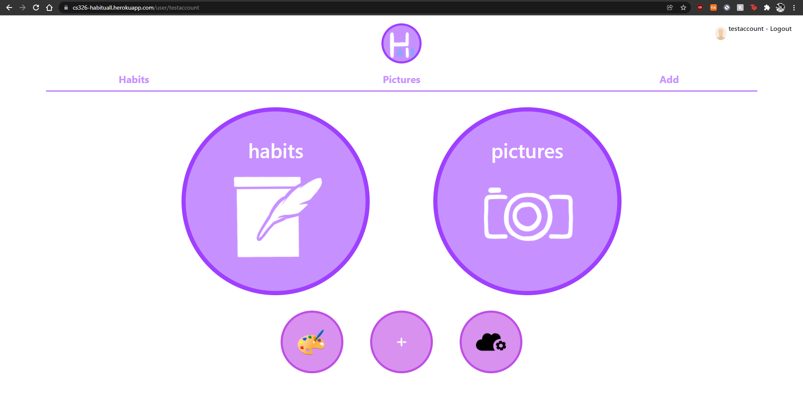
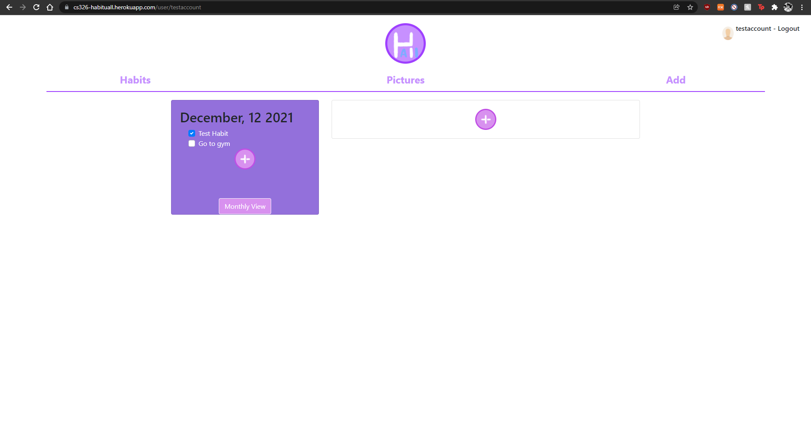
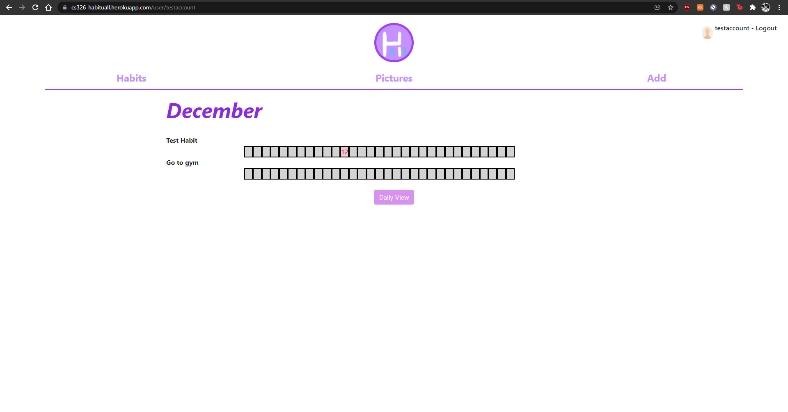
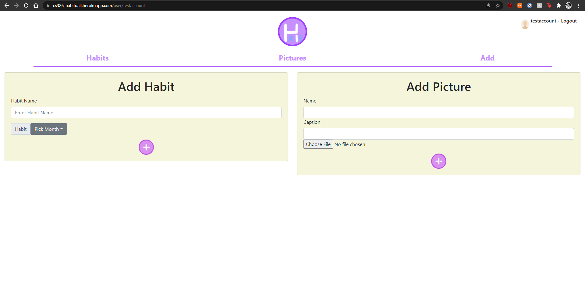

# Title: Team Omega
## Subtitle: HabituALL
## Semester: Fall 2021
## [Link to website](https://cs326-habituall.herokuapp.com/login)
## [Link to video](https://www.youtube.com/watch?v=6AO6GCshDAk&list=PLbTmqqGclWPKulyyrGo2EIt9z1ZfMprdO&index=26)

# Overview
- This application is inspired from the habit tracker portion from bullet journaling. The big difference is that our application allows for photo uploading. This is difficult to do while bullet journaling since not everyone has a method to add pictures to their journal (for example a color printer). The purpose of the app is to promote healthy daily habits as well as giving users a visual aspect to boost their motivation.
- The application is targeted towards the general public but we hope that it would greatly benefit those who have busy days or unhealthy schedules.

# Team Members
- Yunsik Edwin Lee (Github: leeyunsik1999)
- Erin Song (Github: esong2001)
- Swarathmika (Github: swarathmika)

# User Interface
## Login Page
> Page where users log in to access the webpage.

## Register Page
> Page where users can register an account for the webpage.

## Main Page
> Page where users can access the habits, add and pictures page. Clicking on logo redirects here.

## Daily Habits Page
> Page where users can check off their daily habits they keep track of.

## Monthly Habits Page
> Page where users can see the month history of habit completions they are keeping track of.

## Pictures Page
> Page where users can see the pictures they have added for the month.

## Add Page
> Page where users can add habits or images.

# APIs

## Routing and Serving-Related APIs
### GET requests
- /login
  - Checks if user is logged in. If so, redirects to /user. Else, sends the HTML file for login page. Redirects url to \[domain\]/login
- /user
  - Checks logged in. If so, redirects to /user/\[username\]. Else, redirects to /login
- /user/:id/
  - Checks logged in. If so, sends the HTML file for main page and redirects url to /user/\[username\]. Else, redirects to /login
- /
  - Checks logged in. If so, redirects to /user. Else, redirects to /login
- \*
  - Redirects to /

## User-Related APIs
### GET Requests
- /logout
  - Logs out the session that requested a logout. Then, redirects to login page via /login.
### POST Requests
- /login
  - Attempts to log in session with information received. If successful, authenticates session and redirects to main page via /user. Else, redirects to login page via /login
- /register
  - Attempts to create an account with information received. If unsuccessful, sends a message back with appropriate code.

## Event-Related APIs
### GET Requests
- /user/:id/events
  - Fetches all of the user's completed events in history.
- /user/:id/:month/events
  - Gets the events completed by a user in a specific month.
- /user/:id/:month/:day/events
  - Gets the events completed by a user in a specific day.
- /user/:id/:month/eventList
  - Gets all the events that a user is keeping track of on a given month.
### POST Requests
- /user/:id/events
  - Creates an instance of an event's completion with event details and date details.
- /user/:id/eventList
  - Creates an instance of an event to be tracked for the month.
### DELETE Requests
- /user/:id/events
  - Deletes an instance of an event's completion with event details and date details. Opposite of its equivalent POST.
## Pictures-Related APIs
### GET requests
- /images/:user/:id
  - Returns the path to an image pointed at by the image ID
- /:user/:date/images
  - Returns the list of images that a user has on given day as an array of "images" within the JSON value of the key "day" as passed in by API.
- /:user/images/details
  - Returns a list of paths for images of a user as an array of paths within the JSON value of the key "images".

### POST requests
- /:user/:date/images/create
  - Creates a new image. 
  - Adds image to the day's image list, and upload image to images directory with appropriate id.
### PUT requests
- /:user/:id/images/update
  - Updates an image.
- /:user/:id/images/name/update
  - Updates an image's name.
- /:user/:id/images/caption/update
  - Updates an image's caption.

### DELETE requests
- /:user/:id/images/delete
  - Deletes the image from the server.

# Database
A final up-to-date representation of your database including a brief description of each of the entities in your data model and their relationships if any

## Collections
### user
- _id
  - ObjectID
  - Unique objectID that identifies the user. Used to link images, eventLists and events to the user for ownership
- username
  - String
  - The username for this user used for logging in, name display and routing.
- password
  - Array
  - The password for user's login. This is a 2-length array with the salt and hash that represents the password.
### images
- _id
  - ObjectID
  - Unique objectID that identifies the image.
- userID
  - ObjectID
  - Unique objectID that identifies the user that owns the image.
- path
  - String
  - System path to where the image file is located.
- date
  - String (YYYY-MM-DD)
  - Date that the image was uploaded.
- name
  - String
  - Name given to the image.
- caption
  - String
  - Caption given to the image.
### eventList
- _id
  - ObjectID
  - Unique objectID that identifies the event being tracked.
- username
  - String
  - Username that links the user owner of the event.
- name
  - String
  - Name of the event being tracked.
- month
  - String
  - Month that the event is being tracked for.
### event
- _id
  - ObjectID
  - Unique objectID that identifies the event instance.
- userID
  - ObjectID
  - Unique objectID of the user that owns this.
- eventID
  - String
  - objectID representation of the string of the event that this is an instance of.
- username
  - String
  - Username of the user that owns this.
- name
  - String
  - Name of the event.
- month
  - String
  - Month for the event's date.
- day
  - Number
  - Day for the event's date.
- date
  - String
  - YYYYMMDD representing the event instance's date

# URL Routes/Mappings
- \[domain\]/login
  - Used for login and register.
  - Automatically redirects here if the user was not logged in.
- \[domain\]/user/\[username\]
  - Used for the main page.
  - Automatically redirects here if the user is logged in.
  - Attempts to go to /login or a different username route will redirect here until user logs out or session expires.

# Authentication/Authorization
- Authentication for users when logged in is done through the passport library, and individual express sessions are authenticateed.
- No UI view is specifically linked to this except the logout, which un-auth's the session.
- The main page in general cannot be viewed unless a user is logged in, and they are only authorized to view their own page.

# Division of Labor
## Yun's Portions
### Front-End
- Created the pages for login/register, toolbar and main page

### Back-End
- Developed the structure for the web server
- Developed the authentication processes for connections
- Implemented the user-related API routes and database interactions (login, logout, register, hashing)
- Implemented the routing and file serving routes

### Systems Deployment
- Responsible for deploying and maintaining the application on heroku
- Developed the general outline for document structure on database
- Responsible for deploying the MongoDB database and setting up the connection to the web server

## Erin's Portions
### Front-End
- Created the pages for daily / monthly habit tracking

### Back-End
- Implemented the event-related API routes and database interactions

## Swar's Portions
### Front-End
- Created the pages for pictures and adding events / pages

### Back-End
- Implemented the image-related API routes and database interactions

# Conclusion
## Yun's Conclusion
Pretty much everything relating to front-end design, web server design and route design was new to me. I never really worked with anything but testing API routes before, so constructing this from scratch opened my eyes to the world of front-end development, and solidified my beliefs in never wanting to go into front-end. However, I think it was really valuable to know what is going on while working in backend.

I would like to have known some of the packages beforehand. Also, we started with a single html file. Knowing how to split and serve the HTML files beforehand, or incorporating that to our design would have made routing a lot easier, and files more organized. This was hard to do later in the project as there were many things blocking it, hence the limited routing.

The biggest complaint/issue I had was teammates. Having teammates that didn't deliver completely and/or provide extremely limited and agitating communication proved to be a real blocker for progress. Additionally, having everyone need to do portions of front/backend + server contributed to that. While I understand that that was due to this being a class project for everyone to learn all aspects of web development, it was still an aspect that I didn't really like / had difficulty with. 

Doing the project myself, even if it meant learning everything and having extra work, probably would've been less of a headache and less work overall for me. I personally acted as the "manager" and divided / organized / assigned all the tasks, and that was extremely stressful for me.

## Erin's Conclusion
For this project, my main takeaway was creating and using API’s and then integrating those with the website. I enjoyed working on the visual aspect and designing the website the most. Our group’s biggest issue was in terms of communication and timing with our meetings, but things were resolved. The homework and class assignments were a big help to the project; however, it would have been more useful if they were scheduled to match the pace of the project. There were some technical difficulties with async functions and timing regarding those functions. There are also some small QOL details that would have been nice to add but we didn’t have enough time.

## Swar's Conclusion
I enjoyed the process of creating our website. This project really showed me that a good website needs a good plan that outlines the features and requirements before implementation for it to be a cohesive experience for users. I personally had difficulty implementing the front-end design (getting the user images to display as a separate modal and then transition to a pop-up edit form was particularly time consuming). On the contrary, I really enjoyed implementing the server side api endpoints. For me, I feel like understanding the specific databases we can use would be very helpful in creating a tailored api implementation that wouldn't change as we went through the project milestones.

# Grading Rubric
## General (30 pts)
- Routing
- Linted through eslint
- Login details hashed on database
- A working server serving files
- A database storing data

## Authentication (16 pts)
- Only personal pages visible
- Main page not visible if not logged in-- only public page is login / register page

## Login Page (8 pts)
- Routing for login / register
- Allows login from login page, register from register page
- Delivered as a separate html than the main page

## Main Page (8 pts)
- Routed w/ username or userid
- Provides links to pictures, events and add pages

## Daily page (8 pts)
- Displays events being tracked for that day
- Displays pictures for that day
- Has a link to adding pictures/events
- Has a link to monthly page

## Monthly page (8 pts)
- Displays the history of events tracked in that month, and their completion

## Pictures Page (8 pts)
- Displays all pictures belonging to that month
- Can click on picture to have a popup showing image in larger detail, its name and captions

## Add Page (8 pts)
- Can add events and images w/ name and caption

## CRUD (6 pts)
### Create:
- Users
- Events
- Images

### Read:
- View events being tracked 
- View history of events
- View images
- View details of images

### Update:
- Edit events being tracked

### Delete:
- Events being tracked
- Images associated with user