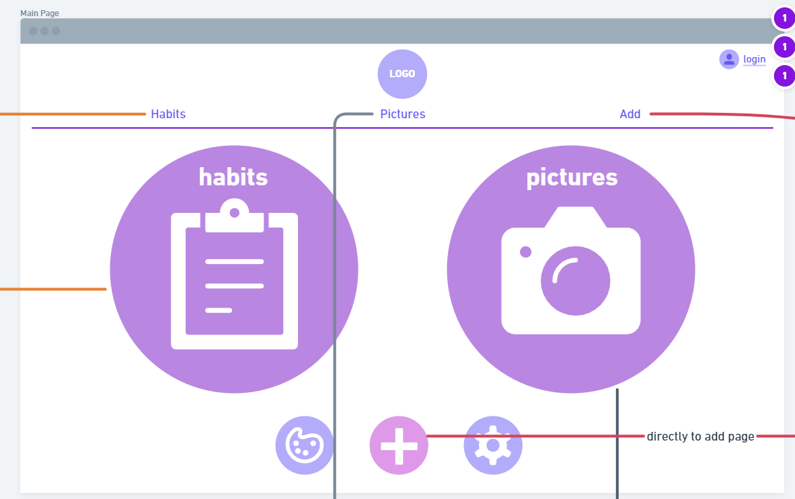
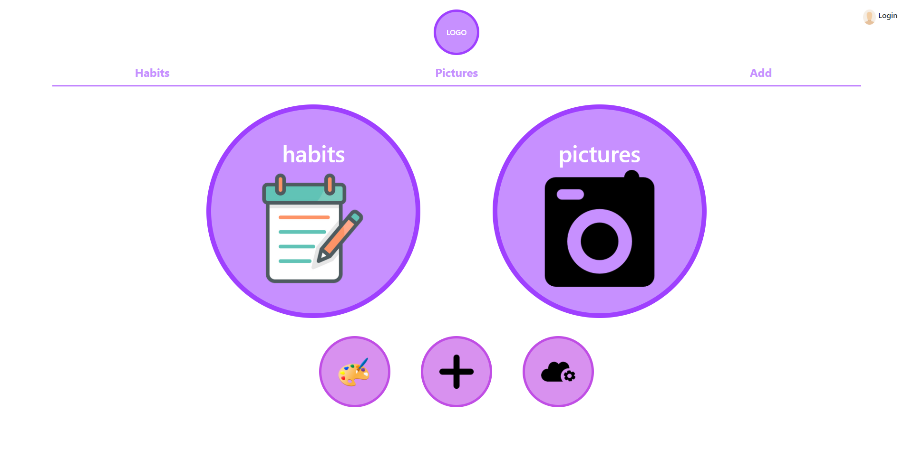
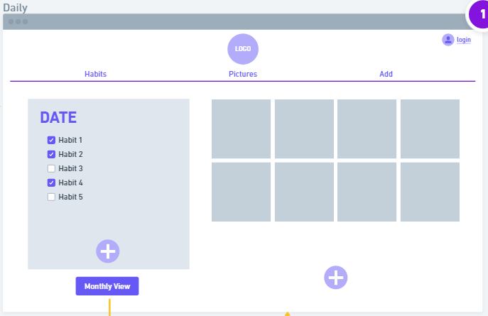
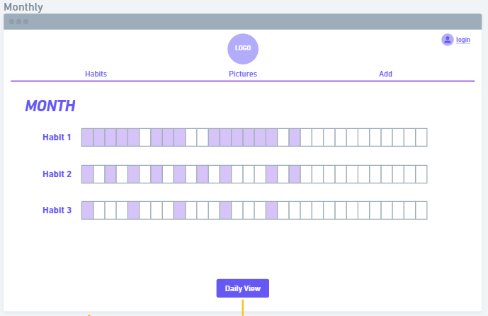
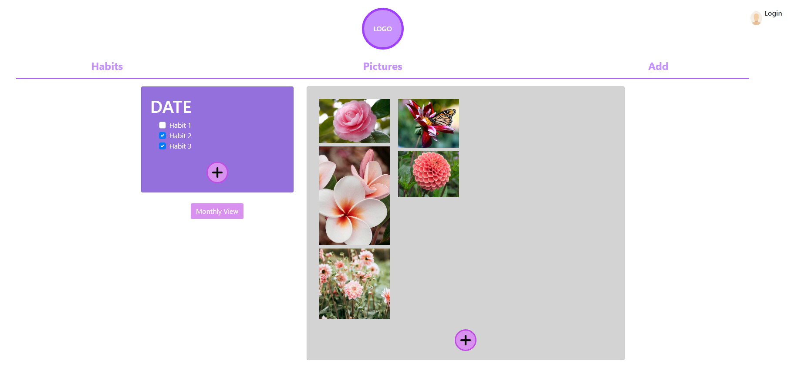
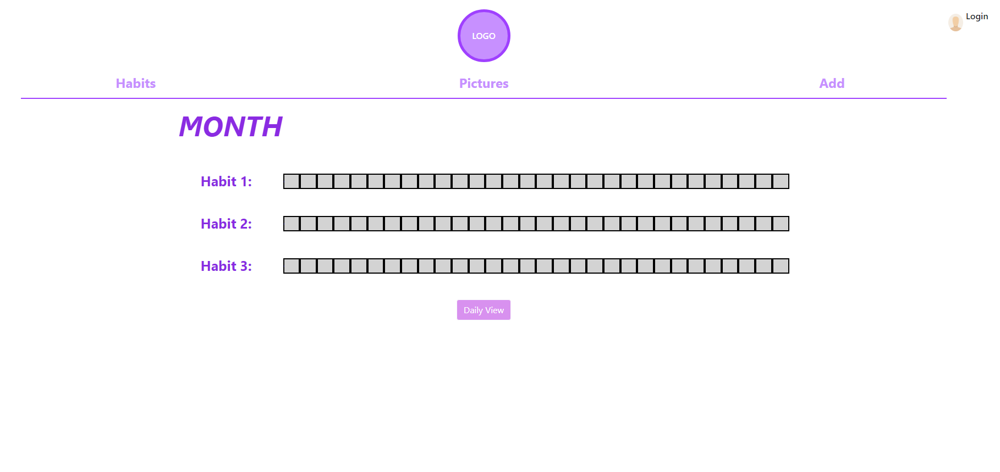

# Part 0: Data Interactions
## Important Data
We will have four main data objects that will be managed: Habits, Habit Events, Pictures, Captions, and Themes. The names are bound to change, but those would be the data objects the user will interact with. We don't include user info in here as per instructions.

## Habits
Habits represent the habits that are being tracked by a user.
- The user should be able to view the list and check them off daily on the Habits/Daily page. This would be its link to Habit Events.
- Users should be able to create, delete and view habits and their record throughout the month.
- This would be stored on the DB with a habit ID, habit name and a user ID. Exact structure is TBD.

## Habit Events
Habit Events represent individual occurences of Habits, and would be used to signal if a habit was completed on a given day.
- The user would be able to create this through checking off a Habit on a given day.
- This would be viewable through the month section of the Habits page, which shows the history of a habit throughout a month. History would be determined by the Habit Events that were created in the past by user interaction.
- This would be stored on the DB with a habit ID, date, boolean for if it was completed or not, and caption ID. Still determining what to use as a primary key.

## Pictures
Pictures are objects that contains any photo that the user has already uploaded previously for viewing.
- Pictures would be created and deleted in the add page, or the pictures page.
- Pictures should be viewable in both the pictures page (as an album) and on the habits page (for pictures connected to that day, and individual events when clicked would be a reach goal).
- This would be stored on the DB with a photo ID (which doubles as the photo's name in storage for easy access), date, linked habit event's primary key, and caption ID. 

## Captions
Captions are objects that contain descriptive text for any object they are linked to. They should be optionally available to add on Habit Events and Pictures.
- Captions would be created under the Add page when uploading pictures, add page for daily captions linked to habit events, and image popups in albums (subject to change).
- This information should be viewable when reviewing individual habit events in the past, or pictures.
- This would be stored on the DB with a Caption ID, text, photo ID and habit event primary key.

## Themes
Themes would be linked to a user and would affect how the website looks in terms of colors.
- This was a fairly recent idea, so there was no time to implement in the mockups except for the theme button.
- The website should be written such that all designs (color-wise) can be changed with ease so we can load themes easily.
- This would be stored on the DB with a theme ID, user ID and other info required to adjust the colors throughout the website.

# Part 1 & 2: Wireframes + HTML/CSS
## Main page
Page that loads when you enter the site and click on the logo.

Contains buttons that takes you to habits page, pictures page and add page, with the toolbar that is functional.

Also illustrates where the themes/settings button would be.

> Wireframe

> HTML/CSS Mockup

## Habits page
Page where all submitted habits and photos will show up.

Contains buttons that will let you add more habits/pictures and go to the monthly view page.

Monthly view page will also return back to daily view page.

> Wireframe

> HTML/CSS Mockup

## Pictures page

## Add page

# Wireframe visual link
https://whimsical.com/habituall-TQPRSdX8HhGURRMvLXXfKY 

# Addendum: Work Distribution
## Yun's To-Do
### Main page
- [x] Implement two main buttons that navigate to habits page and pictures page
- [x] Implement sub-buttons that leads to theme (planned, nothing concrete yet), add habits, and settings (planned, nothing concrete yet) page
- [x] Finish up part0 for milestone 1 markdown
- [x] Responsible for Part 1 and Part 2 descriptions of homepage in markdown

### Other Page Frameworks
- Implement toolbar on top that allows navigation to main page, habits page, pictures page and add habits page
- [ ] ~~Come up with structure that objects should be made to utilize their data~~ Moved to milestone 2
- [x] Includes being able to navigate to other pages, implemented by a empty flexbox where teammates can work on implementing details of other pages (habits, pictures, etc).
  
### Object models to use
- [ ] ~~Image: Would have image ID, captions, optional linked event IDs and date in a json object.~~ Part of datastructures-- moved to milestone 2, coming up with draft right now, however.
- [ ] ~~Event object: Would have ID, name, date and linked image ID. Would have userID as a field in the database, but no need for it front-end.~~ Same as above.

## Erin's To-Do
### Wireframe mock-up
- Designed and finalized the wireframe based on initial hand-drawn designs in whimsical.

### Habits Page
- Responsible for implementing the habits page, layout of events / pictures based on daily/monthly view.
- Implemented switching between daily/monthly.
- ~~Rendering objects based on dummy data using JS.~~ Moved to milestone 2.
- [x] Responsible for Part 1 and Part 2 descriptions of daily page and monthly page.

## Swar's To-Do
### Pictures Page
- ~~Responsible for implementing the pictures page, a grid view of uploaded pictures from dummy data sorted by date.~~ Moved to milestone 2.
- ~~Should be rendering the grid through usage of CSS grid objects and bootstrap dynamically via JS.~~ Moved to milestone 2.
- Should be implementing the HTML/CSS mockup of pictures page and add habits/pictures page.
- [ ] Responsible for Part 1 and Part 2 descriptions of pictures page and add page.

### Add Habits/Pictures page
- Responsible for implementing the habits/pictures page. No need to be functional, just the visual aspects of it.
- ~~Should be loaded through JS.~~ Moved to milestone 2
