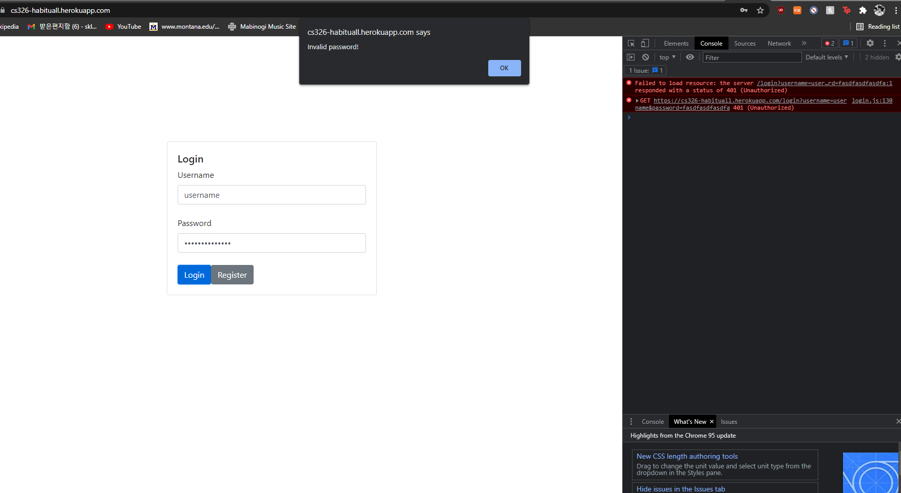
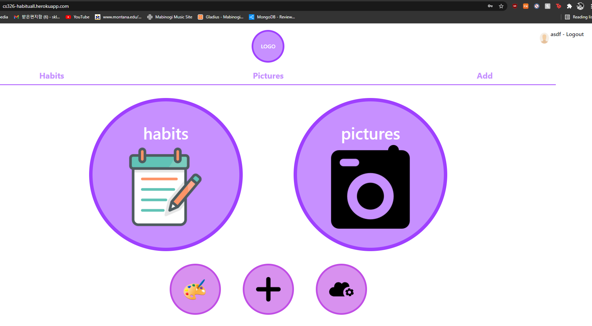

# API Planning
## User-Related endpoints
NOTE: all endpoints using user ID should use user username for demo instead. This will be much easier when we use a database, but json is hard to do it with.

### Yun's Responsibility
- /login?username=username&password=password
  - GET request
  - Queries should be username: username, password: password
  - Should return user ID if username/password is valid. Else, a 404 error for user not found (should signal username/password is invalid)
- /register
  - POST request
  - Body should be: {"username": username, "password": password}
  - Should create the user with given username/password combo. If username exists, a 409 conflicted error should be returned.
  - Create new user with username as key, password as password and a new id with theme default to 1, and data obj with empty value
- /user/id/theme
  - GET request
  - Should return the theme ID of the user's theme settings.
  - Return the theme key's value
- /user/id/theme/set
  - PUT request
  - Body should be {id: #}
  - Should set the theme ID of the user.
  - Update the "theme" value for user data
- /user/id/date
  - GET request
  - Should return the full list of dates that the user has data for.
  - Essentially return an array of keys for "data" value under the user JSON

### Erin's Responsibility
- /user/id/events
  - Should return the list of events that the user currently is keeping track of.
  - Return the array of events within the user JSON data, accessed by key "events"
- /user/id/date/events/create
  - POST request to create a new event.
  - Should add the event to event list in the userdata, and add said event to current day's data.
- /user/id/date/events/update
  - PUT request to update a new event.
  - Should update the given event's name in the events list, current date and any past dates.
- /user/id/date/events
  - Should return the list of events that the user has data for on that day.
  - Return the array of "events" within the JSON value of the key "day" as passed in by API.
- /user/id/date/full_day
  - Should return the data (all events/images) that the user has on given day.
  - Essentially, just return the JSON object that is the value of the appropriate "day" key.

### Swar's responsibility
- /images/id
  - Should return an image buffer with the given id. 404 not found if it doesn't exist.
  - Return the image pointed at by the id (id.jpg-- for example, image id 1 would point to /images/1.jpg) as an image buffer.
- /user/id/date/images?day=yyyymmdd
  - Should return the list of images that the user has data for on that day.
  - Return the array of "images" within the JSON value of the key "day" as passed in by API.
- /user/id/date/images/create
  - POST request to create a new image.
  - Should add image to the day's image list, and upload image to images directory with appropriate id.
- /user/id/date/images/update
  - PUT request to update an image's name or caption.
- /user/id/date/images/delete
  - DELETE request to delete an image.
  - Should delete image from the server. Also delete it from the appropriate date.

# Submission

## Part 1 - API details
- Completed above.

## Part 2 - Screenshots
>Example failed login screen from heroku, unauthorized

>Example main page screen, connected from heroku

## Part 3 - Heroku Deployment
[habituALL on heroku](https://cs326-habituall.herokuapp.com/)
- Notes: Either register account or use the following accounts to gain access:
  - Username: username Password: password
  - Username: user1 Password: asdf1234

# Addendum: Work Distribution
## Yun's To-Do
- [x] Set up API details
- [x] Set up basic server framework so we can expand on it with individual API's
- [x] Set up dummy data for user that will be used for login (username, pw, theme, etc)
- [x] Create example image and event objects to base things off of
- [x] Make main page load via JS and DOM surgery
- [x] Make login page and have it load via JS and DOM surgery
- [x] Implement basic CRUD API regarding user interactions (create user, verify user)
- [x] Deploy on heroku
  
## Erin's To-Do
- [x] Make day page load via JS and DOM surgery
- [x] Make month page load via JS and DOM surgery
- [ ] Make theme page load via JS.
- [ ] Make theme page load/save selection via API's regarding user interactions made by Yun
- [x] Create CRUD API for events (High priority)

## Swar's To-Do
- [ ] Make album page load images via JS and DOM surgery
- [ ] Make add event/images load via JS and DOM surgery
- [ ] Create and use CRUD API for images (High priority)
